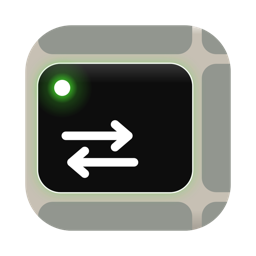
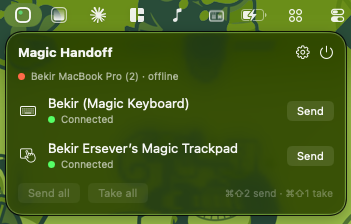

<p align="center">
  
</p>

<h1 align="center">Magic Handoff</h1>

<p align="center">
  Move your Magic Keyboard, Magic Trackpad and Magic Mouse between two Macs with one keystroke.<br>
  No cables, no re-pairing, no Bluetooth menu.
</p>

<p align="center">
  <a href="https://github.com/bekir1184/magic-handoff/releases"></a>
  
  
  
</p>

---

Apple's Magic peripherals only talk to one Mac at a time. If you use a laptop and a desktop, or a work Mac and a personal one, every switch means digging through Bluetooth settings on both machines or plugging in a cable. Magic Handoff makes the switch a single keystroke: press **⌘⇧2** on the keyboard and it, along with the trackpad and mouse, hops to your other Mac. Press **⌘⇧1** there to bring everything back.

<p align="center">
  
  <br>
  <sub>Optional: the keyboard's Caps Lock light confirms each device as it arrives.</sub>
</p>

<p align="center">
  
  <br>
  <sub>The menu: the other Mac's status, your devices, and Send / Take.</sub>
</p>

## Features

- **One keystroke** — ⌘⇧1 and ⌘⇧2 stand for your two Macs. Press the other Mac's key to send everything there; press this Mac's key to bring everything back. Pressing the key of the Mac that already has the devices does nothing.
- **Menu bar status** — the dot in the menu bar icon turns green when every device is on this Mac. Send or take individual devices from the menu.
- **Sleep aware** — close the lid and the devices move to your other Mac; open it and they come back.
- **Keyboard light** (optional) — two short pulses and a long flash on the Caps Lock light as each device connects, so you know it is ready without looking at the screen.
- **Guided setup** — a short first-run wizard explains each permission and what stops working without it. Nothing is requested behind your back.
- **Private by design** — the two Macs talk directly over your local network, encrypted with a key derived from a code you type once. Nothing goes to the internet.

## Requirements

- Two Macs running macOS 14 Sonoma or later, on the same Wi-Fi or wired network.
- Magic Keyboard, Magic Trackpad and/or Magic Mouse (Bluetooth models).
- Each Mac needs its own input to fall back on while the Magic devices are elsewhere: a MacBook's built-in keyboard and trackpad, or a second keyboard on a desktop.

## Install

1. Download the latest `Magic-Handoff-<version>.zip` from [Releases](https://github.com/bekir1184/magic-handoff/releases) on **both** Macs. The app is signed with a Developer ID and notarised by Apple, so it opens like any other app.
2. Unzip and move `Magic Handoff.app` to Applications, then open it.
3. Follow the setup: allow Bluetooth and Local Network, then connect the two Macs. One Mac shows a pairing code; type it into the other. As soon as both hold the same code they find each other automatically.
4. In Settings, give one Mac **⌘⇧1** and the other **⌘⇧2**. The app warns if both use the same number.

That's it. Pair your Magic devices with either Mac the normal way if they aren't already, and press the other Mac's key.

## How it works

Magic devices cannot be shared, but they can be handed over. Magic Handoff automates what plugging the device into the other Mac would do, over the air:

1. **Release.** The Mac that has the device tells `bluetoothd` to refuse the device's own reconnect attempts and then forgets the pairing. The device is now unowned and enters pairing mode on its own.
2. **Take.** The other Mac pairs with it (`IOBluetoothDevicePair`), opens the connection itself the moment pairing completes, and waits until macOS has created the device's HID interface, i.e. until it can actually type or move the pointer.
3. **Coordinate.** The two steps are ordered over the network: the taking Mac asks the other one to release first and starts pairing only after it confirms. Devices are handled one after another; the keyboard goes first so its light can report on the rest.

A full handoff of a keyboard and a trackpad takes about five to seven seconds.

### Under the hood

- **Bluetooth** via IOBluetooth: `IOBluetoothDevicePair` for pairing, `IOBluetoothIgnoreHIDDevice` / `IOBluetoothRemoveIgnoredHIDDevice` (the API behind the "Ignore this device" checkbox) to keep a released device from bouncing back, and connect/disconnect notifications for instant state. Forgetting the pairing uses the private `-remove` selector, the same thing System Settings' *Forget This Device* does.
- **Discovery and transport** via the Network framework: each Mac advertises `_magichandoff._tcp` over Bonjour and connections are TLS 1.2 with a pre-shared key. The key is derived from the pairing code with PBKDF2 (200 000 rounds), so a captured handshake cannot be brute-forced back to the eight-character code. A 16-bit tag of the key is advertised so the app can tell "same code" from "different code" before connecting.
- **Hotkeys** through Carbon's `RegisterEventHotKey`; no Accessibility permission needed.
- **Sleep** handled with IOKit's system power notifications, which let the app finish the handoff before the Mac actually sleeps.
- **Keyboard light** by writing the HID LED output report to the keyboard. Its timing follows indicator-light guidance (IEC 60073 flash bands, pulses of at least 100 ms), and each state is re-sent every 50 ms for the duration of a step so nothing else can leave a visible gap. This is the one feature that needs the Input Monitoring permission, which is why it is off by default.

## Permissions

| Permission | Why | Without it |
|---|---|---|
| Bluetooth | Releasing and connecting the devices | Nothing works |
| Local Network | Finding the other Mac and coordinating the handoff | Only manual connect/release on this Mac |
| Input Monitoring *(optional)* | Driving the keyboard's Caps Lock light | Everything works; no light |

Magic Handoff never reads keystrokes. Input Monitoring is macOS's blanket permission for opening a keyboard device, and the app only uses it to switch one LED.

## Building from source

Requirements: macOS 14+, Xcode 26, [XcodeGen](https://github.com/yonaskolb/XcodeGen).

```bash
brew install xcodegen
scripts/build.sh --run
```

`scripts/build.sh` generates the Xcode project, builds a Development-signed Debug app and launches it. Keep the checkout outside iCloud Drive (for example `~/Developer`); file-provider attributes on synced folders break code signing.

`scripts/release.sh` produces the distributable: a Release build with the hardened runtime, signed with a Developer ID certificate, notarised through `notarytool` and stapled, written to `dist/`.

## Project layout

```
MagicHandoff/
  BluetoothController.swift   release / take, pairing, ignore list, HID readiness
  HandoffCoordinator.swift    send / take orchestration, hotkeys, sleep and wake
  PeerService.swift           Bonjour discovery, TLS-PSK request/reply channel
  CapsLockIndicator.swift     Caps Lock LED patterns and timing
  HotkeyManager.swift         ⌘⇧1 / ⌘⇧2
  SleepMonitor.swift          IOKit power notifications
  OnboardingView.swift        first-run setup
  MenuContentView.swift       menu bar popover
  SettingsView.swift          General / Keyboard Light / Advanced
scripts/                      build.sh, release.sh
design/                       app icon source
```

## Troubleshooting

- **The other Mac shows "different code".** The pairing codes differ. Copy the code from one Mac's Settings into the other's.
- **A device says "held by another Mac?".** It is still connected to the other Mac, which could not be reached. Make sure both Macs are on the same network and the other one is awake, then try again.
- **A device will not come back at all.** Turn it off and on with its switch; it reconnects to the Mac that last paired it. Advanced → *Scan for nearby devices* finds a device neither Mac currently knows.
- **Logs.** Settings → Advanced shows the log, which is also written to `~/Library/Logs/Magic Handoff.log`.

## License

MIT © Bekir Ersever
